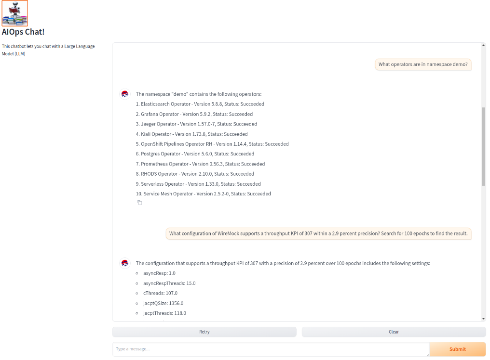

# aiops-on-ocp

## How to create an AI-Ops LLM agent for Red Hat Openshift using Red Hat OpenShift AI

This is a walkthrough guide to create an AIOps chat agent for helping out with IT operations on an OpenShift cluster.

To setup the cluster, inlcuding the RAG part required by the RAG tool, please follow this guide: [llm-on-ocp](https://github.com/eartvit/llm-on-ocp).

The capacity planning tool is source code and model creation (via notebooks) is available in this guide: [mlasp-on-ocp](https://github.com/eartvit/mlasp-on-ocp). Please note that you only need the notebooks. Do not setup the ray operator as described in the [mlasp-on-ocp](https://github.com/eartvit/mlasp-on-ocp) guide since the latest version of Red Hat OpenShift AI (RHOAI) already has Ray and Codeflare installed by default.

Although the ray operator is installed by RHOAI, you still need an instance. Use the kuberay deployment file from [this](https://github.com/eartvit/mlasp-etsad) repository to create a cluster in namespace `raycluster`. Also deploy `MLFlow` as described there. You also need to deploy the tekton pipeline in the `demo` namespace as well as the `Prometheus` community and `Grafana` operators. The repository has some video guides to walk you through. When you install the pipeline tasks, if you want to also have metrics from `node-exporter` install those tasks. Do not install both version of the tasks, they will overwrite each other.

Once you installed the pipeline and the tasks, generate some data (as described in the guide in the repository).

Deploy the `chatbot-ui` using the deployment yaml files in the `chatbot` namespace. You need to create the service account and the service account bindings first before you can create the deployment. Once deployed, add a route to the new application.

Then, go to your deployment, as the scaling is set to `0` and fill in the environment parameters. You can use either a direct LLM inference point (deployed in a vLLM container), or Chat-GPT4-turbo, as an alternative when the VLLM flag is set to false. In this case you need to supply your OPENAI_API_KEY as an environment variable. Once you filled in the required parameters, spin up a pod.

You can now access the route in your browser and chat with your application!

